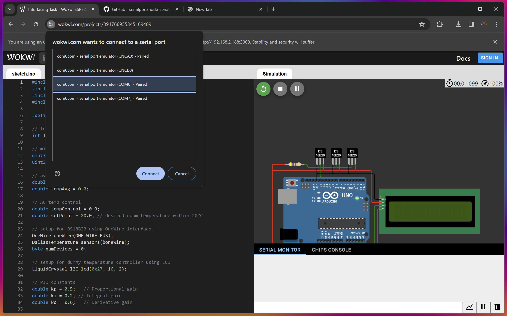

# CE439-Interfacing & Instrumentation - Task 3

## Microcontroller-PC Communication for Temperature Control in an Industrial Metrology Room

Welcome to our project! We've designed a system that helps monitor and control the temperature of an industrial metrology room. This is essential for maintaining a stable environment, ensuring accurate measurements, and overall efficiency.

Our setup involves connecting an Arduino Uno Simulator to a PC. This allows us to communicate between the devices and gather data from temperature sensors placed strategically in the room. The microcontroller acts as the master, while the PC serves as the slave, receiving and processing the data.

To make this communication possible, we utilize a virtual serial port called com0com. This allows us to simulate the connection between the microcontroller and the PC within the Wokwi simulator environment. Through this virtual port, data is transmitted seamlessly, enabling real-time monitoring and control.

Once the data is received by the PC, it's parsed and processed using a Node.js backend. This backend handles the storage of data at regular intervals using serialport library, ensuring that valuable information is recorded and can be accessed when needed.

Additionally, to regulate the temperature effectively, we've implemented a PID controller. This controller adjusts the settings of the air conditioner within the room, maintaining the temperature within a comfortable range of 0 to 40 degrees Celsius.

Furthermore, we've developed a user-friendly front end using React that provides real-time monitoring of the temperature. This allows users to visualize the data and make informed decisions regarding the control of the environment.

## Authors

- Albert Tirto Kusumo (68083)
- Muhammad Fathan Ridhwan (69524)

## Hardware

https://wokwi.com/projects/391766955345169409

To connect to your pc's serial port, please use Chromium based browser and install a [virtual serial port](https://com0com.sourceforge.net/) to use the Web Serial API.

Don't forget to select the pair of the COM port (in my case wokwi uses COM6 and the backend uses COM7)

## Setup

We use MySQL for statistic logging, please create a new database.

Don't forget to change `SERIAL_PORT`, `SERIAL_BAUD_RATE` and `DATABASE_URL` the configuration in `.env` file.

Make sure you have Node.js and latest [pnpm](https://pnpm.io/installation).

1. Clone this repository
2. `pnpm install`
3. `pnpm run migrate`
4. Optionally seed database with dummy data, `pnpm run seed`

To run the development server:
`pnpm run dev`

To build for production:
`pnpm run build`, then `pnpm run start`
